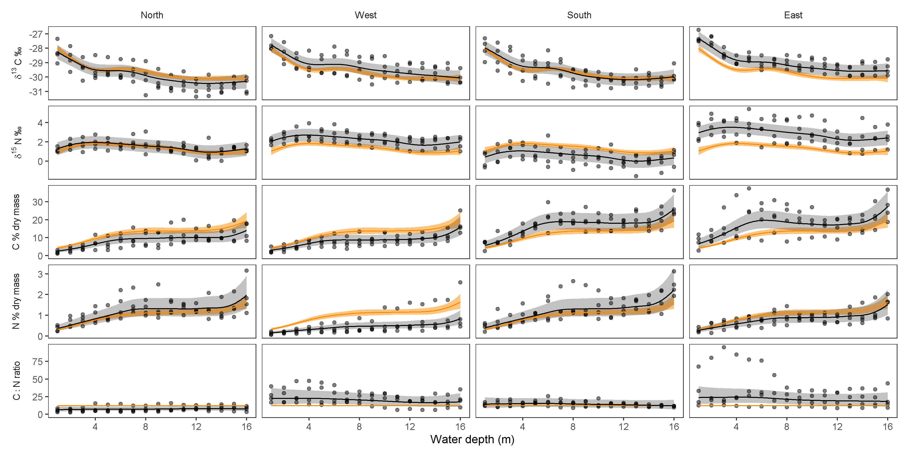

<!--
# Roles

1.  **Research question + hypothesis** (William)

-   clearly identify the research question of interest in the replication?

-   include at least 1 testable hypothesis?

2.  **Data** (Julee, Kate, Kirsten)

-   Description of existing data and/or data collection procedures? (If existing data is included, is the reference(s) to the original data source included?)

-   A description of the variables included in the dataset and/or to be included in the analysis

-   A study design plan? (Kirsten)

3.  **Analysis**

-   Does the pre-registration include at least 1 example statistical analysis using simulated/dummy data?

-   Are the simulated data informed by published data?

4.  **Figure** (William)

-   Does the pre-registration include a figure?

-   summarize/present the key variables in the analysis (with appropriate response and predictor variables)?

-   Include properly labelled axes and a legend (if applicable)?

-   Include a figure caption

5.  **Literature** (Julee)

-   Does the pre-registration include in-text citations and a bibliography of all studies mentioned?
-->
# Study Information

## Title

`r rmarkdown::metadata$title`

## Description

Whole-lake ecosystem processes are complex and hard to quantify. Carbon and nitrogen cycling depend on the composition and abundance of a aquatic organisms, which, in turn, can vary spatio-temporally due to many physical and chemical factors. While most studies on whole-lake ecosystem processes focused focused primarily on pelagic production, @gushulak_effects_2021 presented the first study on nutrient cycling using depth profiles. Using depth profiles of soil $\delta^{13}$C, $\delta^{15}$N, percent C, percent N, and the C to N ratio, they determined that intermediate lake depths offered the best conditions for maximum phytobenthic production. The objective of our study is to replicate the study by @gushulak_effects_2021 while also accounting for the variation between different locations of the lake.

## Hypotheses

Since light availability and disturbance due to currents and mixis affect phytobenthic production, we hypothesize that productivity will be highest at intermediate lake depths, where disturbance is low but the lake is shallow enough to allow large quantities of light to penetrate to the benthic region.

# Design Plan

## Study type

The proposed study is an observational study. Surface layer soil samples will be collected from various transects within the bed of Gall Lake. Isotopic signatures ($\delta^{13}$C, $\delta^{15}$N) and elemental composition (%C, %N, C:N) will be measured in each sample. For further details, see the sampling plan and description of variables below.

## Blinding

Sample will be labeled with a non-descriptive code to remove all information regarding the samples' locations and depths.

## Study design

Superficial soil samples (0-1 cm of depth) will be collected at 1-meter depth intervals (up to 16 m) in Gall Lake, Ontario, Canada, following four orthogonal transects (North, East, South, West). Four independent replicates will be performed along each transect, for a total of $16 \times 4 \times 4 = 256$ soil samples.

## Randomization

No randomization will be present in the study. To reduce sources of anthropogenic of variation, samples will be taken by a single individual on the same week and analyzed by a single technician.

# Sampling Plan

## Existing data

**Registration prior to creation of data**. As of the date of submission of this research plan for preregistration, the data have not yet been collected, created, or realized. All data presented here was simulated based on the data from @gushulak_effects_2021.

## Explanation of existing data

Existing data will not be used in our replication study; all data will be sampled after submitting the preregistration.

## Data collection procedures

Data will be collected at the Gall Lake study site ($50^{\circ} 11''$ N, $90^{\circ} 42''$ W) located in Ontario, Canada. This undisturbed study site is surrounded by boreal forest with a high abundance of black spruce, jack pine, and poplar and a lower abundance of birch, balsam fir, and larch [@kingsbury_consistent_2012]. Data collection will take place in a single week during the summer of 2022.

Surface sediment samples (0-1cm) will be collected using a mini-Glew gravity coring apparatus [@glew_miniature_1991] as was done in @gushulak_effects_2021 at sequential depth intervals, determined using depth sounders [@gushulak_effects_2021]. The surface sediment sampling will be along four depth transects in each of the basins of Gall Lake, to expand upon the area covered in @gushulak_effects_2021 and account for any differences in deposition to the surface sediments due to currents, input, and mixing in Gall Lake. This expansion of coverage will allow us to account for spatial variation among basins, while the replicates along each transect will account for variation within basins to be considered during the statistical analysis.

The stable isotope analysis from the surface sediment samples will be conducted using standard methods [@savage_distribution_2004; @bunting_regulation_2010] using Thermo Finnigan Delta V isotope ratio mass spectrometer that is equipped with a ConFlow IV dilution inlet system, to ensure consistency with the methods of @gushulak_effects_2021.

## Sample size

There will be $n = 16$ surface sediment samples taken at one-meter depth intervals (from 1 m to 16 m) along the four depth transects in each basin of Gall Lake. Each transect will be replicated four times. This will result in a sample size of $N = 16 \times 4 \times 4 = 256$ for our replication study.

## Sample size rationale

The sample size was determined to maximize statistical power while remaining within financial and personnel constraints. In addition, the project will be done in a Bayesian framework, so no Frequentist hypothesis testing will be performed.

## Stopping rule

The entirety of the dataset will be collected as described above. If the entire dataset cannot be collected, such as if Gall Lake is shallower than 16 m at the time of sampling [@kingsbury_consistent_2012], the sample size will be reduced accordingly. If the depth of Gall lake is below 15 m at the time of sampling, additional samples will be taken at intermediate locations (e.g. 1.5 m, 2.5 m, ...) until the sample size of $N = 256$ is reached.

# Variables

## Manipulated variables

No variables will be manipulated in this study, as it is an observational study.

## Measured variables

All measured variables will be reported as was done by @gushulak_effects_2021.

**Depth**: The depth of Gall Lake will be measured along four transects in the lake's basins using a depth sounder as @gushulak_effects_2021 did. Four sediment samples will be collected at every 1-m depth interval along each transect from 1 m to 16 m of depth. In all `R` scripts and data files, the variable will be named `depth_m`.

$\mathbf{\delta^{13}}$**C**: The $^{13}$C isotopic signatures will be measured from freeze-dried sediment samples using a Thermo Finnigan Delta V isotope ratio mass spectrometer with a ConFlow IV dilution inlet system, as described by @gushulak_effects_2021. The values will be recorded using the standard $\delta^{13}$C notation (expressed in parts per thousand relative to the Vienna Pee Dee Belemnite standard, VPDB). 

$\mathbf{\delta^{15}}$**N**: The $^{15}$N isotopic signature will be measured using freeze-dried sediment samples (as above), calibrated using atmospheric gas [@bunting_regulation_2010; @savage_distribution_2004], and recorded using the standard $\delta^{15}$N notation (expressed in parts per thousand relative to the atmospheric abundance of $^{15}$N).

**Nitrogen fraction**: The fraction of nitrogen in the freeze-dried sample, $f_N$, will be calculated using the simple formula $f_N = m_N / m$, where $m_N$ is the mass of nitrogen in the sample and $m$ is the sample's mass. The variable will be named `frac_n` in all datasets and `R` scripts. The percentage of nitrogen in the sample will be used in the figure(s) for consistency with @gushulak_effects_2021, and it will be indicated as `perc_n` in all datasets and `R` scripts (when used).

**Carbon fraction**: The fraction of carbon in the freeze-dried sample will be calculated similarly to the nitrogen fraction (see above). The fractions and percentages of carbon in the freeze-dried samples will be indicated as `frac_c` and `perc_c`, respectively, in all `R` scripts and datasets.

**Carbon to Nitrogen ratio**: The C:N ratio will be expressed as a unit-less number.

## Indices

**Carbon to Nitrogen ratio**: The ratio of carbon to nitrogen will be produced using the simple formula $R = f_C/f_N$, where $f_C$ and $f_N$ are the fractions of carbon and nitrogen in the sample, respectively. In `R` scripts and the dataset, the variable will be named `c_n_ratio`.

# Analysis Plan

All analysis will be performed in `R` [@r_core_team_r_2021]. Data wrangling will be performed with packages from the `tidyverse` set of packages [@wickham_welcome_2019]. All supporting `R` scripts, simulated data, and supporting figures are available in the public GitHub repository at https://github.com/jiaangou/TheBestGroup/.

## Statistical models

Similarly to @gushulak_effects_2021, the isotope data will be analyzed using Generalized Additive Models (GAMs) via the `mgcv` package using and Empirical Bayesian approach, so priors will be estimated by the data [@wood_fast_2011; @wood_generalized_2017]. Although we could estimate priors from the data presented by @gushulak_effects_2021 and fit fully Bayesian models via the `brms` package [@burkner_brms_2017], we will use the `mgcv` package to produce results which are independent from the results of @gushulak_effects_2021.

The amount of $^{15}$N and $^13$C (`d15n` and `d13c` in the `R` scripts and datasets, respectively) will be modeled using a Gaussian conditional distribution with an *identity* link function, since both parameters can be either positive or negative. The fractions of nitrogen and carbon in the samples (`frac_n` and `frac_c`) will be modeled using GAMs with a beta conditional distribution with a *logit* link function, as there is no distribution in the `mgcv` package for numbers strictly between 0 and 100. Finally, the proportion of carbon to nitrogen (`c_n_ratio`) will be modeled using a GAM with a gamma conditional distribution and a *log* link function. Of the distributions available in `mgcv`, a gamma distribution is most appropriate since the ratio is strictly positive but not right-bound.

The effects' Bayesian credible intervals (CIs) will be estimated on the models' link scales using normal approximation ($\pm 1.96$ standard deviations) and back-transformed to the response scale using the models' inverse-link functions. For example, the CIs for the mean C:N will be estimated as the estimated mean $\pm 1.96$ standard deviations on the *log* scale, and then they will be back-transformed to ratios by exponentiating the values. See the example code in the *Other* section and the following section for more information on GAMs and transformations.

All five models accounted for a shared global trend between replicates and trends within-replicate. For simplicity, the smoothness parameter was assumed to be the same between replicates [see model "GS" in @pedersen_hierarchical_2019].

Each model will have three smooth predictors: (1) `s(depth_m, k = 15)` will estimate the mean effect of lake depth, (2) `s(depth_m, basin, k = 10, bs = 'fs')` will account for the variation between basins, and (3) `s(depth_m, replicate, k = 10, bs = 'fs')` will account for the variation within replicates. All three predictors will use thin plate regression splines (the default for the `s()` function in `mgcv`).

The dimension of the basis of each spline was selected to allow the global term (term (1)) to have the greatest complexity (`k = 15`), while the predictors which account for the effect of `basin` and `replicate` on `depth` will have lower complexity. Predictors (2) and (3) can be viewed as estimates of the average deviation of each group from the global trend [see model "GS" in @pedersen_hierarchical_2019]. Predictors (2) and (3) are defined as *factor smooths* (`bs = 'fs'`) since it seems reasonable to assume a common smoothness parameter between basins and between replicates and include the effect of `basin` and `replicate` as random effects. If residual diagnostics show strong autocorrelation due to different levels of smoothness between `basin`s, the second term will be changed to a `by` smooth with the syntax `s(depth_m, by = basin, k = 10)` [see model "GI" in @pedersen_hierarchical_2019]. (In such case, the effect of `basin` will become fixed effect instead of a random effect.)

The models' will be fit via penalized maximum likelihood with a penalty on the smooths' curvatures to avoid over-fitting [@wood_fast_2011; @simpson_modelling_2018]. The smoothness parameters will be optimized using Restricted Marginal Likelihood (`method = 'REML'`), rather than the default Generalized Cross Validation via Mallow's $C_p$ (`'GCV.Cp'`), since REML does not over-fit as often as GCV [@reiss_smoothing_2009; @wood_fast_2011].

Although credible intervals will be estimated, this study will be performed in a purely Bayesian framework, so statistical significance and Frequentist null-hypothesis testing will not be considered. [Also note that the p-values for smooth terms returned by `summary` are approximate and highly uncertain, see @wood_generalized_2017.] Rather, the posterior distributions of the models will be used to assess the likelihood of the results of @gushulak_effects_2021.

## Transformations {#transformations}

The only data transformation that was performed was the conversion of percent carbon and nitrogen (between 0% and 100%) to proportions (between 0 and 1). Note that since the transformation $a = \frac{b}{100}$ is a linear transformation, Jensen's inequality does not apply here [@jensen_sur_1906].

Modeling the data with GAMs removes the need for transforming data that violates the normality assumptions which linear models depend on. Since GAMs estimate transformed mean responses ($g[\mathbb E(Y)]$, where $g(\cdot)$ is the link function) rather than the mean transformed response ($\mathbb E[g(Y)]$), Jensen's inequality [@jensen_sur_1906] does not apply here. 

## Inference criteria

The likelihood of the results by @gushulak_effects_2021 will be assessed based on the 95% credible intervals from the model's posterior distributions. Additional credible intervals (75%, 90%) will be also calculated to provide more information on the posterior distributions.

## Data exclusion

All data will be checked with simple sanity checks. Any unreasonable values (e.g. proportions outside the interval $[0, 1]$, and negative C:N ratios) will be checked for errors during transcription, calculations, and coding. All calculations will be done in `R` scripts, and the original raw data will not be modified unless to correct errors. If no reasonable error source can be detected, the outlier(s) will be removed, but we will present the models fit to the full dataset and the models fit to the cleaned dataset.

## Missing data

Any rows with missing data will be removed from the dataset for the respective model(s) only. For example, a missing $\delta^{15}$N value will affect the $\delta^{15}$N model, but the row will not be removed from the datasets used in the other four models. The removal of missing values is automated by the `gam()` function in the `mgcv` package.

# Other

## Model definition

\singlespacing

```{r models, eval = FALSE}
# stable nitrogen isotope
m_d15n <-
  gam(d15n ~
        # average effect of depth across all basins and replicates
        s(depth_m, k = 15) +
        # effect of basin (keep complexity < that of global smooth)
        s(depth_m, basin, k = 10, bs = 'fs') +
        # effect of replicates (keep complexity < that of basin)
        s(depth_m, replicate, k = 5, bs = 'fs'),
      family = gaussian(link = 'identity'),# conditional distribution
      data = isotopes,
      # optimize the smoothness parameter via REML (see ?mgcv::gam)
      method = 'REML')

# stable carbon isotope
m_d13c <-
  gam(d13c ~
        s(depth_m, k = 15) +
        s(depth_m, basin, k = 10, bs = 'fs') +
        s(depth_m, replicate, k = 5, bs = 'fs'),
      family = gaussian(link = 'identity'),
      data = isotopes,
      method = 'REML')

# fraction of carbon in the samples
m_frac_c <-
  gam(frac_c ~
        s(depth_m, k = 15) +
        s(depth_m, basin, k = 10, bs = 'fs') +
        s(depth_m, replicate, k = 5, bs = 'fs'),
      # logit(0) = -Inf, logit(1) = Inf
      family = betar(link = 'logit'),
      data = isotopes,
      method = 'REML')

# fraction of nitrogen in the samples
m_frac_n <-
  gam(frac_n ~
        s(depth_m, k = 15) +
        s(depth_m, basin, k = 10, bs = 'fs') +
        s(depth_m, replicate, k = 5, bs = 'fs'),
      family = betar(link = 'logit'),
      data = isotopes,
      method = 'REML')
```

<!-- broke chunk in to to avoid splitting between pages -->

\newpage

```{r models2, eval=FALSE}
# C:N ratio in the samples
m_c_n <-
  gam(c_n_ratio ~
        s(depth_m, k = 15) +
        s(depth_m, basin, k = 10, bs = 'fs') +
        s(depth_m, replicate, k = 5, bs = 'fs'),
      # log(0) = -Inf, log(Inf) = Inf
      family = Gamma(link = 'log'),
      data = isotopes,
      method = 'REML')
```

## Prediction example
```{r, eval = FALSE}
# predicting using m_c_n model (given a dataset `new_data`)
bind_cols(
  new_data, # bind data used for predictions to the predictions
  predict(object = m_c_n, # model from which to predict
          newdata = new_data, # "new" data for predictions
          type = 'link', # predict on the log scale
          se.fit = TRUE)) %>% # include the standard error
  mutate(mu = exp(fit), # move mean to the response scale
         lwr = exp(fit - 1.96 * se.fit), # create 95% CIs, then
         upr = exp(fit + 1.96 * se.fit)) # move to the response scale
```

## Supporting figure

```{r, out.width='100%', echo=FALSE, fig.cap='Simulated data and resulting smooths with 95\\% Bayesian credible intervals. The data was simulated starting from the data presented by Gushulak \\textit{et al.} (2021) and adding Brownian motion to each basin and each sample. The smooths and 95\\% CIs from the models of Gushulak \\textit{et al.} (2021) are superimposed in orange.', fig.pos='h'}



```

\newpage

# References

<!-- uncomment the tex section if using output: prereg::cos_prereg -->
<!--
```{=tex}
\vspace{-2pc}
\setlength{\parindent}{-0.5in}
\setlength{\leftskip}{-1in}
\setlength{\parskip}{8pt}
```
-->
\noindent
